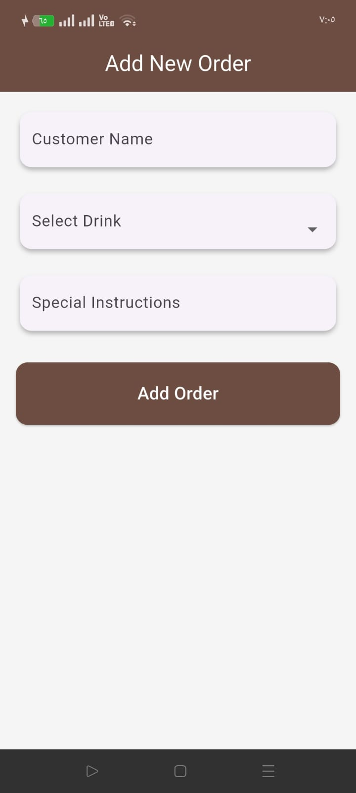
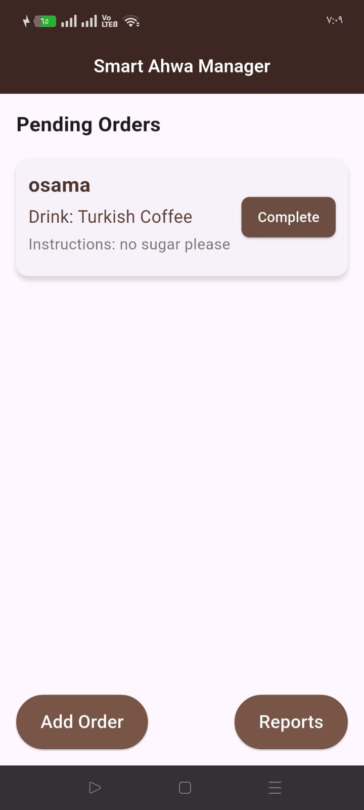
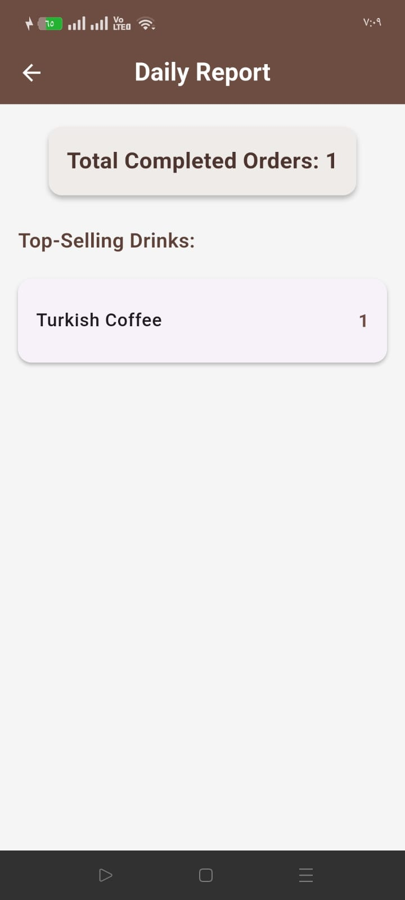

# Smart Ahwa Manager App 🍵

A Flutter application designed for managing customer orders in traditional Egyptian cafés (Ahwa). Built with SOLID principles and modern Flutter best practices.

## 📱 Features

- **Order Management**: Add customer orders with name, drink type, and special instructions
- **Pending Orders**: View and manage all pending orders in real-time
- **Daily Reports**: Generate reports showing top-selling drinks and total orders served
- 
## 🏗️ Architecture

This app demonstrates the implementation of SOLID principles in Flutter:

### Single Responsibility Principle (SRP)

- `OrderManager`: Handles all order-related data operations
- Each screen focuses on its specific functionality

### Open-Closed Principle (OCP)

- Easy to extend with new drink types or order features
- No need to modify existing code when adding new functionality

### Dependency Inversion Principle (DIP)

- UI components depend on `OrderManager` abstraction
- Screens are not tightly coupled to specific data implementations

## 🛠️ Technical Stack

- **Framework**: Flutter
- **Language**: Dart
- **State Management**: StatefulWidget with setState

## 📁 Project Structure

```
lib/
├── main.dart                     # App entry point
├── models/
│   ├── drink.dart                # Drink classes
│   └── order.dart                # Order model
├── managers/
│   └── order_manager.dart        # Business logic and order management
├── screens/
│   ├── home_screen.dart          # Dashboard & pending orders
│   ├── add_order_screen.dart     # Add new orders
│   └── report_screen.dart        # Daily reports
└── widgets/
    └── order_tile.dart           # Reusable order card

```


## 📸 Screenshots


|                     home screen                     |                       Add Order                       |
| :----------------------------------------------------: | :---------------------------------------------------: |
|  |  |

|                     Pending Orders                     |                     Report                      |
| :----------------------------------------------------: | :-----------------------------------------------------: |
|  |  |


## 🔧 Key Components

### OrderManager

Core service class handling:

- Handles adding, completing, and tracking orders
- Generates daily reports
- Maintains pending and completed orders lists

### Order Model

Simple data class representing:

- Customer name
- Tracks order status (pending / completed)
- Special instructions
- Completion status

### Drink Model

- Abstract Drink class
- Concrete drink types like Tea, HibiscusTea, TurkishCoffee, Espresso, Latte, Cappuccino


## 🎯 SOLID Principles Implementation

This project serves as a practical demonstration of SOLID principles in Flutter development:

1. **S**ingle Responsibility: Each class has one clear purpose
2. **O**pen-Closed: Extensible design without modifying existing code
3. **L**iskov Substitution: Components can be replaced without breaking functionality
4. **I**nterface Segregation: Focused, minimal interfaces
5. **D**ependency Inversion: High-level modules don't depend on low-level details

## 📱 Supported Platforms

- ✅ Android
- ✅ iOS
- ✅ Web (with limitations on SharedPreferences)

## 🤝 Contributing

Contributions are welcome! Please feel free to submit a Pull Request.

## 👨‍💻 Author

**Osama Saad**

- LinkedIn: [Abdelrahman Mohammed](https://www.linkedin.com/in/osama-saad-a9970b250/)

## 🙏 Acknowledgments

This project was developed as part of an OOP and SOLID principles assessment, demonstrating practical application of software engineering principles in Flutter development.

